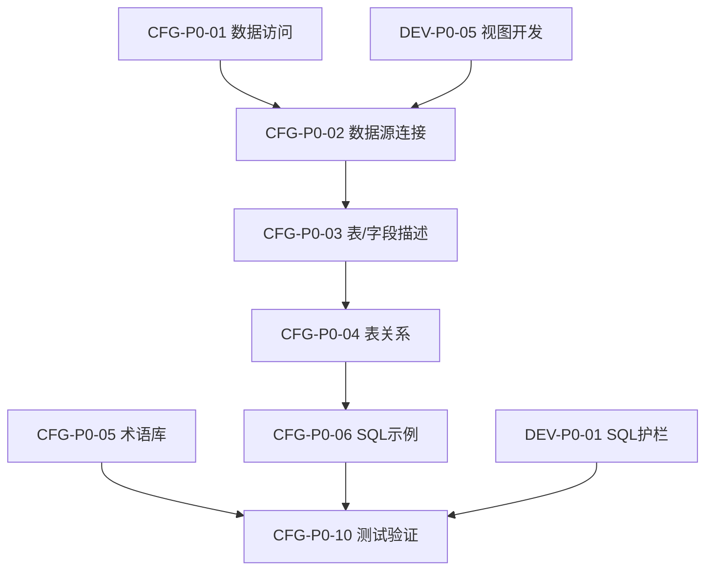

# NC 财务智能问数系统实施方案

> 基于 SQLBot 构建面向 NC 财务系统的智能问数平台，优先保证查询准确度与小白用户开箱即用。

---

## 参考文档

| 类型 | 链接 |
|:---|:---|
| SQLBot 官方文档 | https://dataease.cn/sqlbot/v1/ |
| 官方最佳实践（四步调优） | https://dataease.cn/sqlbot/v1/best_practice/ |
| 术语配置 | https://dataease.cn/sqlbot/v1/user_manual/professional/ |
| SQL 示例库 | https://dataease.cn/sqlbot/v1/user_manual/data_training/ |
| 自定义提示词 | https://dataease.cn/sqlbot/v1/user_manual/prompt/ (X-Pack) |
| 本地调优指南 | `docs/developer/nc-financial-tuning-guide.md` |
| 术语模板 | `apply/NC_财务术语库_配置模板.md` |
| SQL示例模板 | `apply/NC_财务SQL示例库_配置模板.md` |

---

## 1. 项目目标与范围

### 1.1 目标与指标

| 目标 | 衡量标准 |
|:---|:---|
| 查询精准度 | SQL 首次正确率 > 80%，执行成功率 > 95% |
| 开箱即用 | 非技术用户可完成 20+ 常见财务查询 |
| NC 适配度 | 覆盖 NC 核心财务场景与组织/期间口径 |

### 1.2 范围定义

- **In**: NC 财务核心场景问数；SQLBot 配置调优；必要二次开发提升稳定性与易用性
- **Out**: 跨系统联邦查询、复杂报表引擎替代、非财务领域深度定制

---

## 2. 总体方案与关键决策

### 2.1 官方四步调优方法

> ⚠️ 自定义提示词为 **X-Pack 功能**；开源版优先完成四步调优即可获得较好效果。

### 2.2 数据层处理策略

| 方案 | 描述 | 优点 | 代价 |
|:---:|:---|:---|:---|
| **A** | 视图/中间表预处理 | dr=0、vouchstatus>=3 固化在视图，表关系与 SQL 示例更简单 | 需 DBA 创建与维护视图 |
| **B** | 直接表配置 | 无需改动数据库结构，实施更快 | 表关系、示例、提示词更复杂 |

**建议**: 若 DBA 可配合，采用方案 A；否则采用方案 B，并增加 SQL 护栏与模板规则兜底。

---

## 3. 配置类工作清单

### 3.1 P0 配置（必须完成）

| 编号 | 工作项 | 工时 | 说明 |
|:---|:---|:---:|:---|
| **CFG-P0-01** | 数据访问与安全基线 | 1天 | 创建只读账号；配置访问权限；明确审计规则 |
| **CFG-P0-02** | 数据源连接与元数据同步 | 1天 | 创建数据源，同步视图(A)或核心表(B) |
| **CFG-P0-03** | 表/字段描述与别名 | 1天 | 为视图/表字段设置业务别名与描述 |
| **CFG-P0-04** | 表关系管理 | 0.5天 | 维护视图间(A)或核心表间(B)关系 |
| **CFG-P0-05** | 术语库建设 | 2天 | 基于模板录入 30+ 术语 |
| **CFG-P0-06** | SQL 示例库建设 | 2天 | 基于模板录入 50+ 示例 |
| **CFG-P0-07** | 权限与安全配置 | 1天 | 规则组 + 行级权限 + 列级权限 |
| **CFG-P0-08** | AI 模型配置 | 0.5天 | 添加模型、设置参数、验证可调用 |
| **CFG-P0-09** | 用户与工作空间配置 | 0.5天 | 创建用户/角色，分配到工作空间 |
| **CFG-P0-10** | 测试验证与调优 | 3天 | 设计 20+ 场景，执行测试并补齐配置 |

**P0 合计**: 约 12.5 天

### 3.2 P1 配置（尽量完成）

| 编号 | 工作项 | 工时 |
|:---|:---|:---:|
| CFG-P1-01 | 术语与示例扩展（同比环比、辅助核算） | 2天 |
| CFG-P1-02 | 新手问题模板库（50-100个可直接点击的问题） | 1天 |
| CFG-P1-03 | 评测集与周度复盘（100题金标集） | 2天 |

### 3.3 P2 配置（可选）

- 多组织对比模板与 KPI 扩展
- 知识库导出/导入打包
- 嵌入式小助手

---

## 4. 二次开发清单

### 4.1 P0 开发（必须）

| 编号 | 工作项 | 工时 | 说明 |
|:---|:---|:---:|:---|
| **DEV-P0-01** | SQL 护栏与规则重写 | 2天 | 方案 B 必需：注入 dr=0、vouchstatus 过滤 |
| **DEV-P0-02** | 主题域/表分组与检索收敛 | 1天 | NC 表规模大时降低检索噪声 |
| **DEV-P0-03** | NC Starter Pack 一键导入 | 1天 | 术语/示例/规则打包，开箱可用 |
| **DEV-P0-04** | 自定义提示词兜底 | 1天 | 若 X-Pack 不可用，补开源版提示词注入 |
| **DEV-P0-05** | 视图开发脚本 | 2天 | 方案 A：创建 4+ 预处理视图 |

**P0 开发合计**: 约 7 天（根据方案选择可减少）

### 4.2 P1 开发（尽量完成）

| 编号 | 工作项 | 工时 |
|:---|:---|:---:|
| DEV-P1-01 | 预置财务问题模板（前端快捷入口） | 2天 |
| DEV-P1-02 | 组织切换优化（SQL注入过滤） | 2天 |
| DEV-P1-03 | 会计期间智能识别（本月/上月/本季度） | 2天 |
| DEV-P1-04 | 性能优化（超时/成本限制、缓存） | 1天 |

### 4.3 P2 开发（可选）

- 财务看板/报表模板扩展
- 金额格式化与单位处理
- 科目编码智能补全

---

## 5. 时间计划

> T0 = 项目启动日，截止 2025-02-10

### Phase A（T0 ~ T0+2周）- 基础配置

- [ ] 完成 CFG-P0-01 ~ CFG-P0-09
- [ ] 启动 DEV-P0-01/02 方案设计
- [ ] 确定采用方案 A 或方案 B

### Phase B（T0+2周 ~ 2025-02-10）- 开发与验证

- [ ] 完成 DEV-P0-01 ~ DEV-P0-05
- [ ] 完成 CFG-P0-10（测试验证）
- [ ] 完成 CFG-P1 配置
- [ ] 发布 NC Starter Pack

### Phase C（2025-02-11 之后）- 持续优化

- [ ] 推进 P2 配置与 P1/P2 开发
- [ ] 周度复盘与评测

---

## 6. 依赖关系

---

## 7. 资料准备清单

### 数据库相关（P0）
- [ ] NC 数据库连接信息（IP/端口/库名）
- [ ] 只读账号与授权清单
- [ ] NC 版本确认（NC/NCC/BIP）

### 业务相关（P0）
- [ ] 常用科目清单（编码+名称）
- [ ] 组织架构（编码+名称）
- [ ] 常见财务问题清单（20+）
- [ ] 业务规则说明（状态口径、过滤逻辑）

### 技术相关（P1）
- [ ] NC 表结构文档（如有）
- [ ] 现有报表 SQL 样例

---

## 8. 验收标准

| 指标 | 标准 |
|:---|:---|
| 核心问题首答正确率 | > 80% |
| SQL 执行成功率 | > 95% |
| 权限规则 | 生效且满足隔离要求 |
| SQL 示例 | 50+ 可正常检索 |
| 术语 | 30+ 可正常检索 |

---

## 9. 风险与应对

| 风险 | 应对措施 |
|:---|:---|
| 自定义提示词为 X-Pack | DEV-P0-04 兜底 |
| 方案 A 视图维护成本高 | 建立变更同步流程 |
| NC 表规模大 | 主题域分组与字段启用控制 |
| SQL 性能风险 | 只读账号 + 超时/成本限制 |

---

*文档版本: v2.0*  
*最后更新: 2026-01-07*
