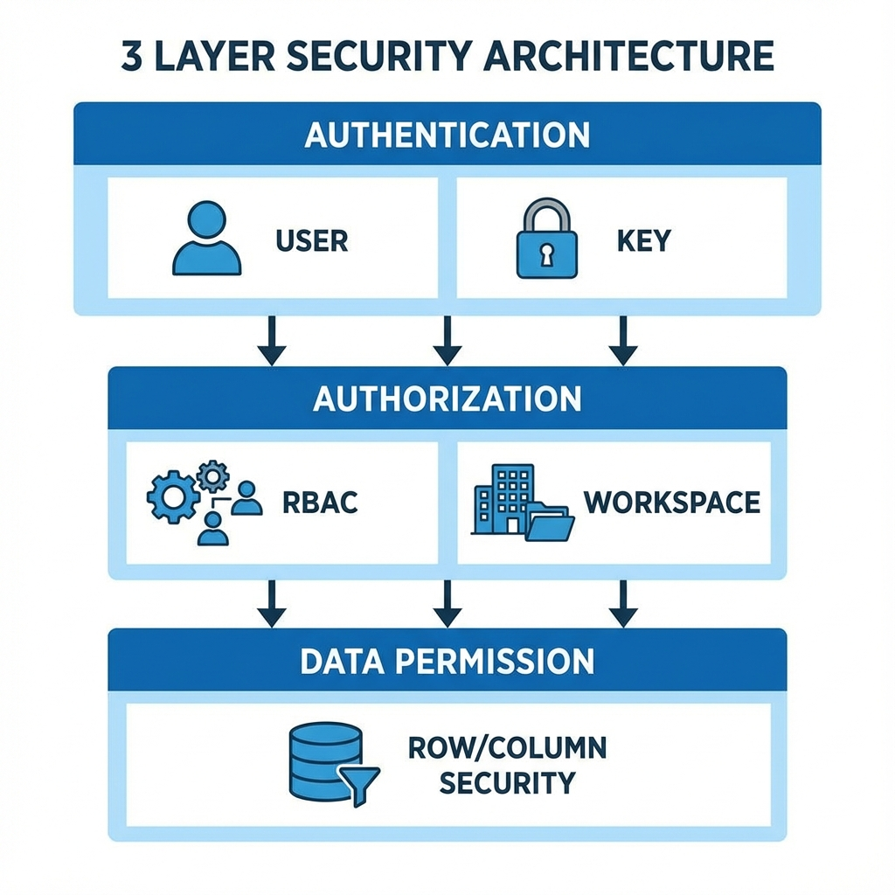
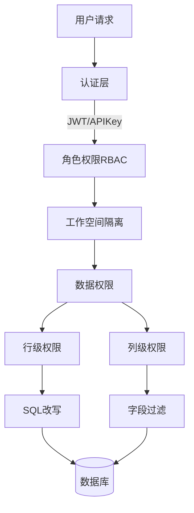
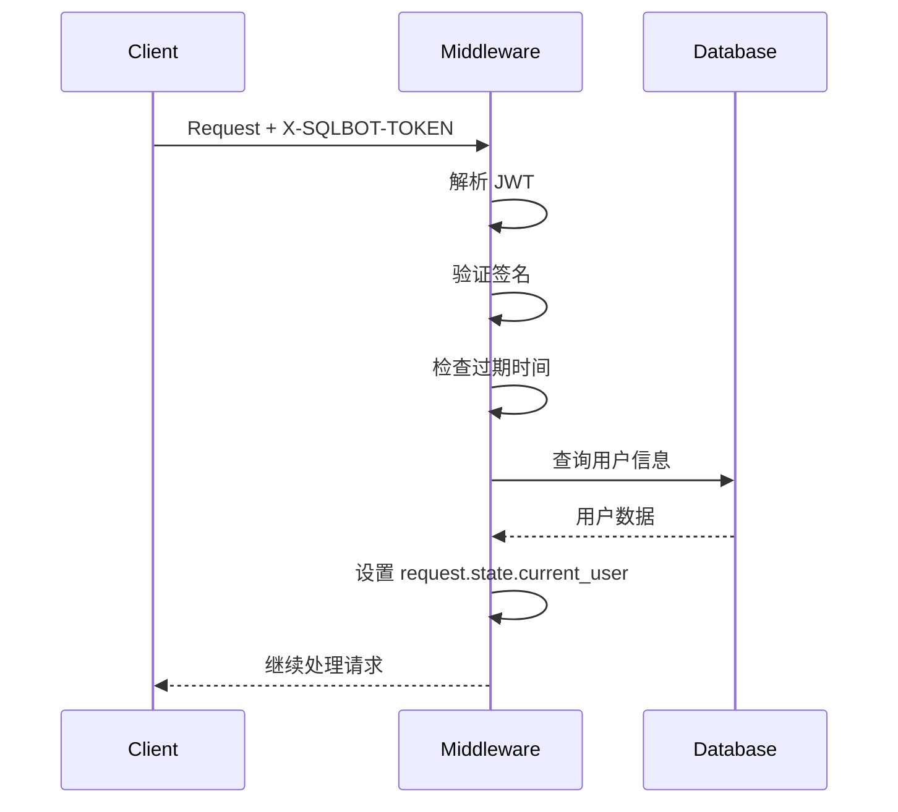
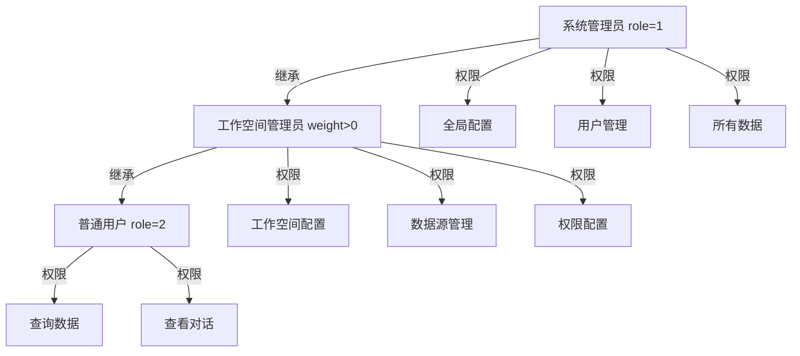
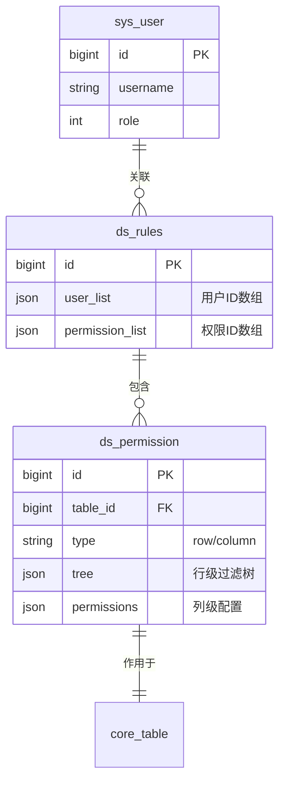
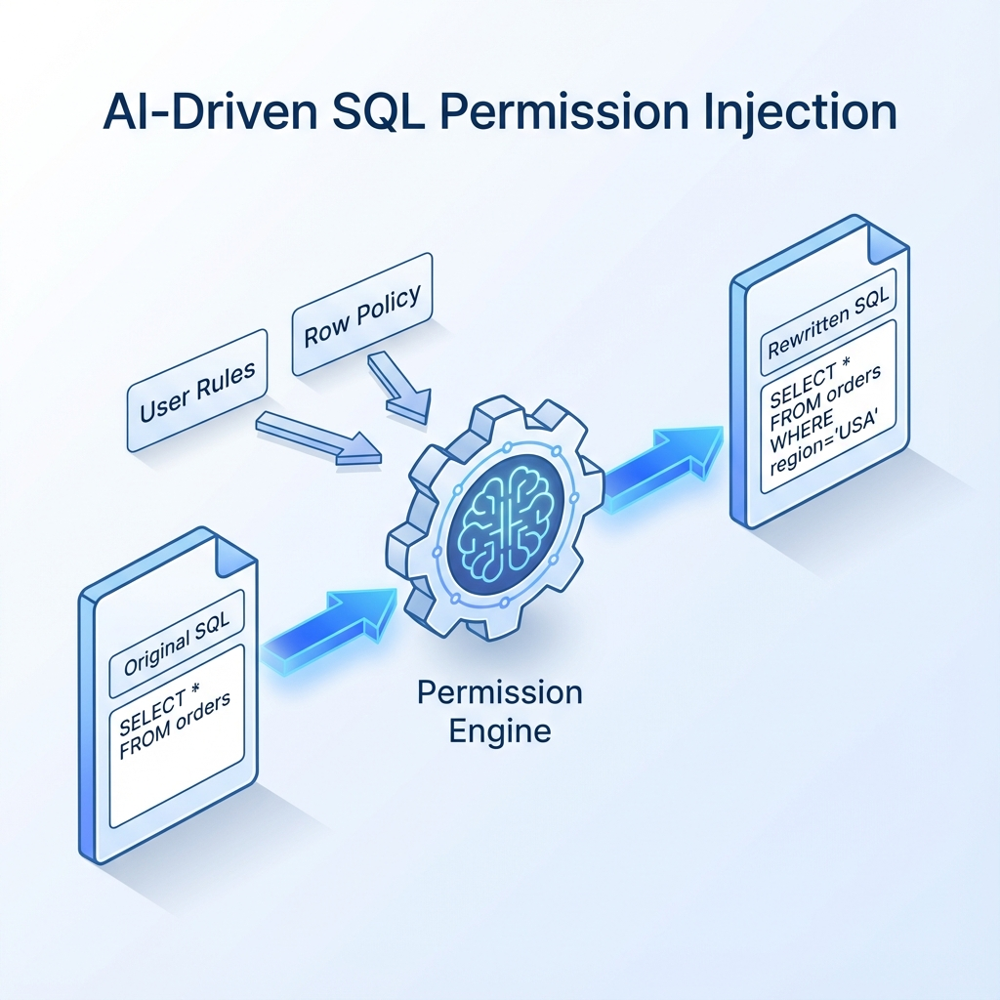
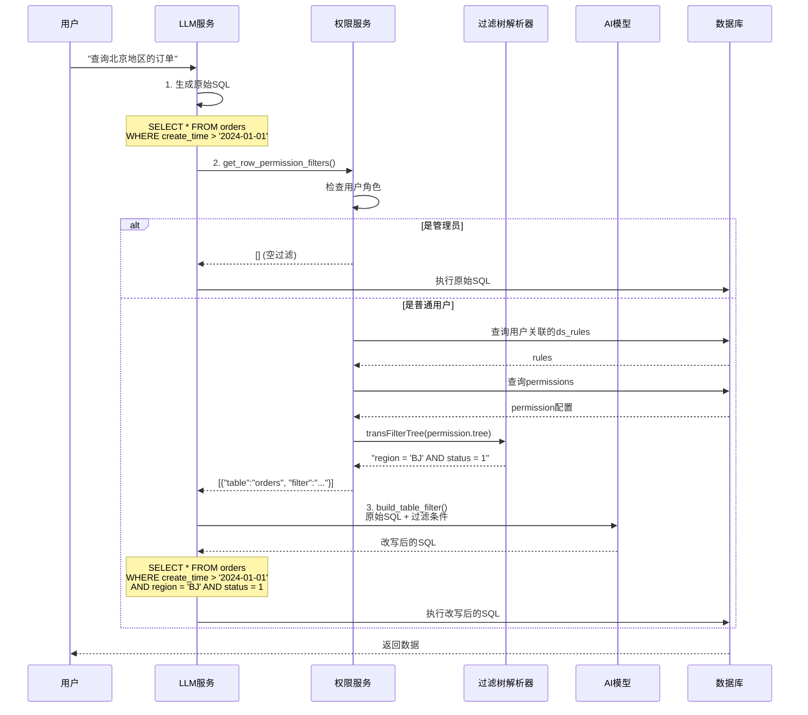
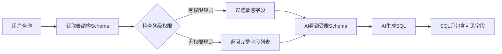
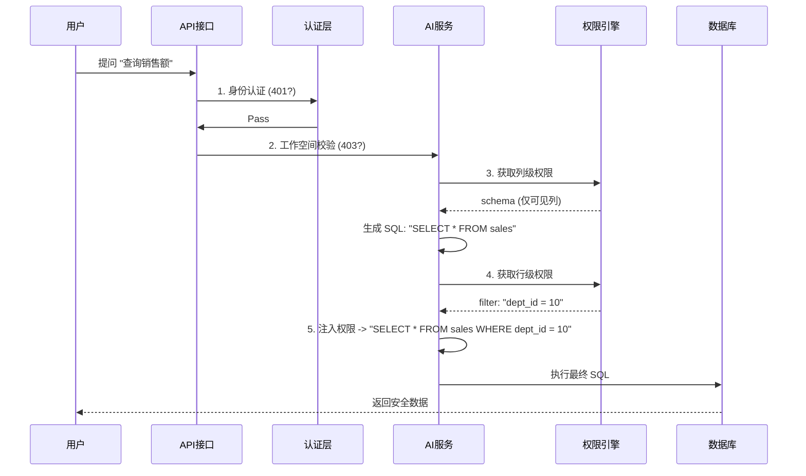

# SQLBot 数据库权限控制实现详解



## 1. 权限架构概览

SQLBot 系统采用**多层权限控制机制**，从认证、授权到数据访问进行全方位的安全管控。



---

## 2. 三层权限控制体系

### 2.1 认证层 (Authentication)

**实现位置**: [`apps/system/schemas/permission.py`](file:///Users/knight/workspace/SQLBot/backend/apps/system/schemas/permission.py)

#### 认证方式对比

| 方式 | 传递格式 | 适用场景 | 生命周期 |
|:---|:---|:---|:---|
| **JWT Token** | `X-SQLBOT-TOKEN` | Web 前端用户 | 默认 8 天 |
| **API Key** | `Bearer <key>` | 第三方系统集成 | 永久有效 |
| **Assistant** | `X-SQLBOT-ASSISTANT` | 嵌入式页面 | 随会话 |

#### JWT Token 认证详解

**Token 结构**:

```python
payload = {
    "sub": user_id,         # 用户 ID
    "exp": expiration_time, # 过期时间
    "iat": issued_at,       # 签发时间
    "oid": workspace_id,    # 当前工作空间
}
```

**验证流程**:



### 2.2 授权层 (Authorization)

#### 角色权限 (RBAC)

通过装饰器 `@require_permissions` 实现细粒度控制。

**角色层级**:



**装饰器实现**:

```python
@require_permissions(permission=SqlbotPermission(role=['ws_admin']))
async def create_datasource(...):
    """仅工作空间管理员可执行"""
    pass

@require_permissions(permission=SqlbotPermission(
    type='ds', 
    keyExpression="datasource_id"
))
async def query_data(datasource_id: int, ...):
    """校验用户是否有该数据源的访问权限"""
    pass
```

**权限校验逻辑** ([源码](file:///Users/knight/workspace/SQLBot/backend/apps/system/schemas/permission.py#L43-L95)):

1. 检查用户是否已认证 → 未认证返回 401
2. 如果是系统管理员 (`isAdmin=True`) → 直接放行
3. 检查角色权限 (`role` 参数) → 不符合抛出异常
4. 检查资源权限 (`type` + `keyExpression` 参数)
5. 通过 `check_ws_permission` 验证资源是否属于用户的工作空间

#### 工作空间隔离 (Workspace Isolation)

> [!NOTE]
> 这是一个强制的物理隔离层，确保多租户数据完全隔离。

**隔离机制**:

- 所有核心表包含 `oid` (Organization ID) 字段
- 查询自动注入 `WHERE oid = ?` 条件
- 完全隔离不同租户的数据源、对话记录和知识库

**示例**:

```python
# 用户A (oid=100) 查询对话
SELECT * FROM chat WHERE uid = 1

# 系统自动改写为
SELECT * FROM chat WHERE uid = 1 AND oid = 100
```

---

## 3. 数据权限核心实现 (重点)

这是系统最核心的安全机制，实现了**细粒度**的数据访问控制。

### 3.1 权限模型设计

#### 数据库表结构

**ds_permission** (权限配置表):

| 字段 | 类型 | 说明 |
|:-----|:-----|:-----|
| `id` | BIGINT | 权限配置ID |
| `table_id` | BIGINT | 目标表ID |
| `type` | VARCHAR | 权限类型: 'row' 或 'column' |
| `name` | VARCHAR | 权限规则名称 |
| `permissions` | JSON | 列级权限配置 (type='column'时使用) |
| `tree` | JSON | 行级权限过滤树 (type='row'时使用) |

**ds_rules** (权限规则关联表):

| 字段 | 类型 | 说明 |
|:-----|:-----|:-----|
| `id` | BIGINT | 规则ID |
| `permission_list` | JSON | 权限配置ID列表 `[1, 2, 3]` |
| `user_list` | JSON | 用户ID列表 `[10, 20, 30]` |

**三表关系**:



### 3.2 行级权限 (Row-Level Security)

行级权限通过**动态SQL改写**实现。当普通用户查询数据时，系统会自动拦截 SQL 并注入过滤条件。



#### 完整执行流程



#### 代码实现详解

**步骤1: 获取权限过滤条件**

参考 [`permission.py:get_row_permission_filters`](file:///Users/knight/workspace/SQLBot/backend/apps/datasource/crud/permission.py#L14-L45):

```python
def get_row_permission_filters(session, current_user, ds, tables):
    """
    获取用户在指定表上的行级权限过滤条件
    
    Returns:
        [
            {"table": "orders", "filter": "region = 'BJ'"},
            {"table": "customers", "filter": "area_code IN ('010', '021')"}
        ]
    """
    filters = []
    
    # 管理员用户直接放行
    if is_normal_user(current_user):  # current_user.id != 1
        # 获取所有权限规则 (用于匹配用户和权限的关联)
        contain_rules = session.query(DsRules).all()
        
        for table in table_list:
            # 查询该表的行级权限配置
            row_permissions = session.query(DsPermission).filter(
                and_(
                    DsPermission.table_id == table.id,
                    DsPermission.type == 'row'
                )
            ).all()
            
            # 收集适用于当前用户的权限
            applicable_permissions = []
            for permission in row_permissions:
                # 检查该权限是否分配给了当前用户
                for rule in contain_rules:
                    p_list = json.loads(rule.permission_list)
                    u_list = json.loads(rule.user_list)
                    
                    # 权限在规则中 AND 用户在规则中
                    if (permission.id in p_list and 
                        current_user.id in u_list):
                        applicable_permissions.append(
                            transRecord2DTO(session, permission)
                        )
                        break
            
            # 将权限配置树转换为 WHERE 子句字符串
            where_clause = transFilterTree(session, applicable_permissions, ds)
            
            filters.append({
                "table": table.table_name,
                "filter": where_clause
            })
    
    return filters
```

#### 权限过滤树详解

**树形结构设计**:

权限配置以树形结构存储，支持复杂的逻辑组合 (AND/OR)：

```json
{
    "logic": "AND",
    "items": [
        {
            "type": "item",
            "field_id": 101,
            "term": "eq",
            "value": "北京"
        },
        {
            "type": "tree",
            "sub_tree": {
                "logic": "OR",
                "items": [
                    {
                        "type": "item",
                        "field_id": 102,
                        "term": "in",
                        "enum_value": ["销售部", "市场部"]
                    },
                    {
                        "type": "item",
                        "field_id": 103,
                        "term": "ge",
                        "value": "3"
                    }
                ]
            }
        }
    ]
}
```

**转换为SQL**:

```sql
(region = '北京' AND (department IN ('销售部', '市场部') OR level >= 3))
```

**支持的操作符**:

| 操作符 term | SQL 语句 | 示例 |
|:------------|:---------|:-----|
| `eq` | `=` | `region = '北京'` |
| `not_eq` | `<>` | `status <> 0` |
| `lt` / `le` | `<` / `<=` | `amount < 1000` |
| `gt` / `ge` | `>` / `>=` | `level >= 3` |
| `in` / `not in` | `IN` / `NOT IN` | `dept IN ('A', 'B')` |
| `like` / `not like` | `LIKE` / `NOT LIKE` | `name LIKE '%张%'` |
| `null` / `not_null` | `IS NULL` / `IS NOT NULL` | `remark IS NULL` |
| `between` | `BETWEEN` | `date BETWEEN a AND b` |

**树解析实现** ([源码](file:///Users/knight/workspace/SQLBot/backend/apps/datasource/crud/row_permission.py)):

```python
def transFilterTree(session, tree_list, ds):
    """将多个权限树合并为一个WHERE子句"""
    res = []
    for dto in tree_list:
        tree = dto.tree
        tree_exp = transTreeToWhere(session, tree, ds)
        if tree_exp:
            res.append(tree_exp)
    
    # 多个权限规则用 AND 连接
    return " AND ".join(res)


def transTreeToWhere(session, tree, ds):
    """递归将树转换为WHERE表达式"""
    if tree is None:
        return None
    
    logic = tree['logic']  # AND 或 OR
    items = tree['items']
    
    expressions = []
    for item in items:
        if item['type'] == 'item':
            # 叶子节点 - 单个条件
            exp = transTreeItem(session, item, ds)
        elif item['type'] == 'tree':
            # 子树 - 递归处理
            exp = transTreeToWhere(session, item['sub_tree'], ds)
        
        if exp:
            expressions.append(exp)
    
    # 用括号包裹，确保逻辑正确
    return '(' + f' {logic} '.join(expressions) + ')'


def transTreeItem(session, item, ds):
    """将单个过滤项转换为SQL片段"""
    field = session.query(CoreField).filter(
        CoreField.id == item['field_id']
    ).first()
    
    if not field:
        return None
    
    # 获取数据库方言
    db = DB.get_db(ds.type)
    field_name = f"{db.prefix}{field.field_name}{db.suffix}"
    
    # 处理枚举值 (IN 操作)
    if item['filter_type'] == 'enum':
        values = "', '".join(item['enum_value'])
        return f"({field_name} IN ('{values}'))"
    
    # 处理普通条件
    operator = transFilterTerm(item['term'])
    value = item['value']
    
    # 特殊情况处理
    if item['term'] in ['null', 'not_null']:
        return f"{field_name}{operator}"
    elif item['term'] in ['in', 'not in']:
        values = "', '".join(value.split(","))
        return f"{field_name}{operator}('{values}')"
    elif item['term'] in ['like', 'not like']:
        return f"{field_name}{operator}'%{value}%'"
    else:
        return f"{field_name}{operator}'{value}'"
```

#### AI 驱动的 SQL 改写

**步骤3: 调用 LLM 改写 SQL**

参考 [`llm.py:build_table_filter`](file:///Users/knight/workspace/SQLBot/backend/apps/chat/task/llm.py#L646-L687):

```python
def build_table_filter(self, session, sql, filters):
    """
    使用 AI 模型智能注入权限过滤条件
    
    Args:
        sql: 原始SQL
        filters: [{"table": "orders", "filter": "region = 'BJ'"}]
    
    Returns:
        改写后的SQL
    """
    # 构造过滤信息
    filter_json = json.dumps(filters, ensure_ascii=False)
    self.chat_question.sql = sql
    self.chat_question.filter = filter_json
    
    # 构造 Prompt
    permission_sql_msg = [
        SystemMessage(content=self.chat_question.filter_sys_question()),
        HumanMessage(content=self.chat_question.filter_user_question())
    ]
    
    # 记录日志
    self.current_logs[OperationEnum.GENERATE_SQL_WITH_PERMISSIONS] = start_log(
        session=session,
        operate=OperationEnum.GENERATE_SQL_WITH_PERMISSIONS,
        full_message=[{'type': msg.type, 'content': msg.content} 
                      for msg in permission_sql_msg]
    )
    
    # 调用 LLM 流式生成
    full_filter_text = ''
    token_usage = {}
    res = process_stream(self.llm.stream(permission_sql_msg), token_usage)
    
    for chunk in res:
        if chunk.get('content'):
            full_filter_text += chunk.get('content')
    
    # 记录结果
    permission_sql_msg.append(AIMessage(full_filter_text))
    end_log(session, ...)
    
    return full_filter_text
```

**Prompt 模板示例**:

```
System: 你是一个SQL专家。你需要在给定的SQL语句中注入权限过滤条件。

User:
原始SQL:
SELECT order_id, customer_name, amount, create_time
FROM orders
WHERE create_time > '2024-01-01'

需要注入的权限过滤条件:
[
    {"table": "orders", "filter": "region = '北京' AND status = 1"}
]

请改写SQL，在WHERE子句中添加权限过滤条件。确保:
1. 保留原有的WHERE条件
2. 使用AND连接新的过滤条件
3. 保持SQL语法正确

请直接返回改写后的SQL，不要有其他解释。
```

**AI 返回**:

```sql
SELECT order_id, customer_name, amount, create_time
FROM orders
WHERE create_time > '2024-01-01'
  AND region = '北京'
  AND status = 1
```

#### 实战配置示例

**场景: 销售人员只能查看自己区域的订单**

**1. 创建权限配置**:

```sql
INSERT INTO ds_permission (table_id, type, name, tree) VALUES (
    15,  -- orders表ID
    'row',
    '区域隔离-销售人员',
    '{
        "logic": "AND",
        "items": [
            {
                "type": "item",
                "field_id": 205,
                "term": "eq",
                "value": "${user.region}"  -- 动态变量
            },
            {
                "type": "item",
                "field_id": 206,
                "term": "not_eq",
                "value": "已取消"
            }
        ]
    }'
);
```

**2. 创建权限规则并关联用户**:

```sql
INSERT INTO ds_rules (permission_list, user_list) VALUES (
    '[100]',        -- 权限ID
    '[201, 202]'    -- 销售人员用户ID
);
```

**3. 效果验证**:

- 用户201询问: "查询本月订单量"
- 生成SQL: `SELECT COUNT(*) FROM orders WHERE MONTH(create_time) = MONTH(NOW())`
- 自动改写: 
  ```sql
  SELECT COUNT(*) FROM orders 
  WHERE MONTH(create_time) = MONTH(NOW())
    AND region = '华东'
    AND status <> '已取消'
  ```

### 3.3 列级权限 (Column-Level Security)

列级权限通过**字段过滤机制**实现，在AI生成SQL之前就将敏感字段从Schema中移除，从根源上防止泄漏。

#### 核心原理

与行级权限在SQL执行前改写不同，列级权限的控制点更早：



> [!IMPORTANT]
> **关键特性**: AI模型在生成SQL时根本"看"不到被隐藏的字段，无法在生成的SQL中引用敏感列，从源头防止数据泄漏。

#### 实现机制详解

**实现位置**: [`datasource/crud/permission.py:get_column_permission_fields`](file:///Users/knight/workspace/SQLBot/backend/apps/datasource/crud/permission.py#L48-L72)

**执行流程**:

```python
def get_column_permission_fields(session, current_user, table, fields, contain_rules):
    """
    过滤字段列表，移除用户无权访问的列
    
    Args:
        fields: 原始字段列表 [Field1, Field2, Field3, ...]
        contain_rules: 包含当前用户的权限规则
    
    Returns:
        过滤后的字段列表 [Field1, Field3, ...]  # Field2被移除
    """
    if is_normal_user(current_user):  # 管理员用户不过滤
        # 1. 查询该表的列级权限配置
        column_permissions = session.query(DsPermission).filter(
            and_(DsPermission.table_id == table.id, 
                 DsPermission.type == 'column')
        ).all()
        
        for permission in column_permissions:
            # 2. 检查用户是否在此权限规则中
            for rule in contain_rules:
                p_list = json.loads(rule.permission_list)  # [权限ID列表]
                u_list = json.loads(rule.user_list)         # [用户ID列表]
                
                if permission.id in p_list and current_user.id in u_list:
                    # 3. 应用字段过滤
                    permission_list = json.loads(permission.permissions)
                    fields = filter_list(fields, permission_list)
                    break
    
    return fields
```

**字段过滤函数**:

```python
def filter_list(fields, permission_list):
    """
    根据权限配置过滤字段
    
    permission_list 示例:
    [
        {"field_id": 1, "enable": true},   # 保留
        {"field_id": 2, "enable": false},  # 移除
        {"field_id": 3, "enable": true}    # 保留
    ]
    """
    # 构建需要隐藏的字段ID集合
    hidden_field_ids = {
        item['field_id'] 
        for item in permission_list 
        if not item['enable']
    }
    
    # 过滤掉隐藏字段
    return [field for field in fields if field.id not in hidden_field_ids]
```

#### 权限配置示例

**场景1: 隐藏薪资敏感字段**

假设 `employees` 表有以下字段：

| field_id | field_name | field_type | 描述 |
|:---------|:-----------|:-----------|:-----|
| 101 | emp_id | VARCHAR | 员工ID |
| 102 | emp_name | VARCHAR | 员工姓名 |
| 103 | department | VARCHAR | 部门 |
| 104 | salary | DECIMAL | **薪资 (敏感)** |
| 105 | bonus | DECIMAL | **奖金 (敏感)** |
| 106 | email | VARCHAR | 邮箱 |

**权限配置** (针对普通HR人员):

```json
{
    "table_id": 15,  // employees表ID
    "type": "column",
    "permissions": [
        {"field_id": 101, "enable": true},   // emp_id ✅
        {"field_id": 102, "enable": true},   // emp_name ✅
        {"field_id": 103, "enable": true},   // department ✅
        {"field_id": 104, "enable": false},  // salary ❌ 隐藏
        {"field_id": 105, "enable": false},  // bonus ❌ 隐藏
        {"field_id": 106, "enable": true}    // email ✅
    ]
}
```

**效果**:

- 普通HR询问: "查询研发部的员工信息"
- AI看到的Schema: `emp_id, emp_name, department, email` (没有salary和bonus)
- 生成的SQL: `SELECT emp_id, emp_name, department, email FROM employees WHERE department = '研发部'`
- **无法查询薪资**: 即使用户明确问"查询研发部员工的薪资"，AI也会因为Schema中不存在salary字段而报错或提示无权限

#### 应用时机

列级权限在以下关键时机被调用:

**时机1: 获取表Schema时**

参考 [`datasource.py:get_table_schema`](file:///Users/knight/workspace/SQLBot/backend/apps/datasource/crud/datasource.py#L315):

```python
def get_table_schema(session, current_user, ds, question):
    # ... 获取表和字段列表 ...
    
    # 应用列级权限过滤
    filter_mapping = get_row_permission_filters(...)
    contain_rules = session.query(DsRules).all()
    
    for table in tables:
        # 获取字段
        fields = session.query(CoreField).filter(
            CoreField.table_id == table.id
        ).all()
        
        # ⭐ 关键: 过滤掉受限字段
        fields = get_column_permission_fields(
            session, current_user, table, fields, contain_rules
        )
        
        # 构建Schema字符串 (只包含可见字段)
        schema += format_table_schema(table, fields)
    
    return schema
```

**时机2: AI生成SQL前**

在LLM Service的Prompt构建阶段，传入的`db_schema`已经是过滤后的版本:

```python
# llm.py
self.chat_question.db_schema = get_table_schema(
    session=_session,
    current_user=self.current_user,  # 传入当前用户
    ds=self.ds,
    question=self.chat_question.question
)

# Schema示例 (已过滤):
"""
Table: employees
Columns: 
  - emp_id (VARCHAR): 员工ID
  - emp_name (VARCHAR): 员工姓名
  - department (VARCHAR): 部门
  - email (VARCHAR): 邮箱
"""
```

#### 典型应用场景

**场景1: 财务系统**
- 隐藏字段: `实际成本`, `利润率`, `供应商折扣`
- 可见用户: 仅CFO和财务总监

**场景2: 人力资源系统**
- 隐藏字段: `薪资`, `绩效得分`, `离职意向`
- 可见用户: 仅HRBP和总监

**场景3: 技术审计字段**
- 隐藏字段: `creator`, `modifier`, `ts` (时间戳), `dr` (删除标记)
- 原因: 业务用户无需关心技术字段，减少AI幻觉

#### 与行级权限的对比

| 维度 | 列级权限 | 行级权限 |
|:-----|:---------|:---------|
| **作用对象** | 控制可查询的**字段** | 控制可查询的**数据行** |
| **触发时机** | AI生成SQL **之前** | AI生成SQL **之后** |
| **实现方式** | Schema过滤 | SQL动态改写 (WHERE注入) |
| **AI可见性** | AI完全"看不到"受限字段 | AI能看到表结构,但数据被过滤 |
| **绕过难度** | ⭐⭐⭐⭐⭐ (几乎不可能) | ⭐⭐⭐⭐ (依赖SQL改写正确性) |

#### 配置检查清单

在生产环境启用列级权限前，请确保:

- [ ] 已识别所有敏感字段 (薪资、成本、个人隐私等)
- [ ] 为每个角色创建了字段可见性矩阵
- [ ] 测试: 受限用户询问敏感字段时，AI返回"字段不存在"错误
- [ ] 审计: 记录了谁配置了哪些列级权限规则

---

## 4. 完整权限控制流程



---

## 5. 常见问题与故障排查

### 5.1 权限未生效

**症状**: 配置了行级权限，但用户仍能看到所有数据

**排查步骤**:

1. **检查用户是否为管理员**
   ```python
   # 管理员 (id=1) 不受权限限制
   SELECT id, username, role FROM sys_user WHERE id = <用户ID>;
   ```

2. **检查权限规则关联**
   ```sql
   -- 查看用户是否在规则中
   SELECT * FROM ds_rules 
   WHERE user_list LIKE '%<用户ID>%';
   
   -- 查看规则包含的权限
   SELECT * FROM ds_permission WHERE id IN (<permission_list>);
   ```

3. **检查权限树配置**
   ```sql
   SELECT tree FROM ds_permission WHERE id = <权限ID>;
   ```

4. **启用调试日志**
   ```python
   # llm.py
   SQLBotLogUtil.info(f"Filters: {filters}")
   SQLBotLogUtil.info(f"Rewritten SQL: {sql_result}")
   ```

### 5.2 AI无法理解权限限制

**症状**: AI在回答中提到"无权访问"，但没有返回数据

**原因**: AI看到的Schema已被过滤，但仍尝试回答问题

**解决方案**:

在自定义Prompt中添加指引:

```
当用户询问的字段不在表结构中时，请明确告知:
"该字段受权限限制，无法查询。如需访问，请联系管理员申请权限。"
```

### 5.3 性能问题

**症状**: 配置权限后查询变慢

**优化建议**:

1. **为过滤字段添加索引**
   ```sql
   CREATE INDEX idx_region ON orders(region);
   ```

2. **简化权限树**
   - 避免过多嵌套层级
   - 将常用条件前置

3. **使用缓存**
   ```python
   # 缓存权限规则查询结果
   @lru_cache(maxsize=1000)
   def get_user_permissions(user_id):
       ...
   ```

---

## 6. 安全特性总结

> [!IMPORTANT]
> **多层防御**: 即使攻破一层，仍有后备防线。
> **AI 驱动**: 利用大模型能力灵活处理复杂的权限注入，优于传统的正则替换。

| 特性 | 说明 | 安全等级 |
|:---|:---|:---|
| **HTTPS 加密** | 全链路数据传输加密 | 🔒 基础 |
| **AES 存储** | 数据库密码、API Key 等敏感信息加密存储 | 🔒🔒 中级 |
| **RBAC** | 严格的角色访问控制 | 🔒🔒🔒 高级 |
| **SQL 动态注入** | 强制行级过滤，无法绕过 | 🔒🔒🔒🔒 核心 |
| **最小权限原则** | 数据库连接建议使用只读账号 | 🔒🔒🔒🔒🔒 最佳实践 |

---

## 7. 关键代码索引

| 文件 | 功能 | 核心方法 |
|:---|:---|:---|
| [`permission.py`](file:///Users/knight/workspace/SQLBot/backend/apps/system/schemas/permission.py) | 认证与授权 | `require_permissions`, `check_ws_permission` |
| [`datasource/crud/permission.py`](file:///Users/knight/workspace/SQLBot/backend/apps/datasource/crud/permission.py) | 数据权限 | `get_row_permission_filters`, `get_column_permission_fields` |
| [`row_permission.py`](file:///Users/knight/workspace/SQLBot/backend/apps/datasource/crud/row_permission.py) | 过滤树解析 | `transFilterTree`, `transTreeToWhere`, `transTreeItem` |
| [`llm.py`](file:///Users/knight/workspace/SQLBot/backend/apps/chat/task/llm.py) | AI处理 | `generate_filter`, `build_table_filter` |
