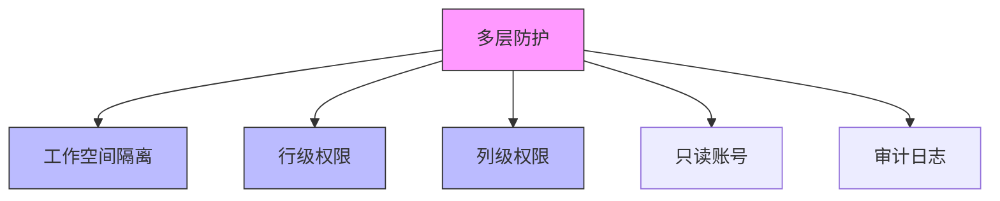
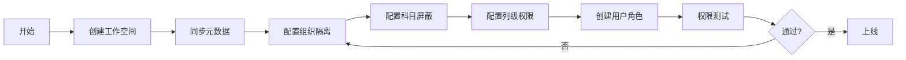
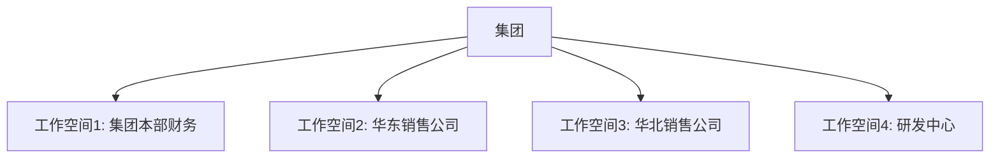
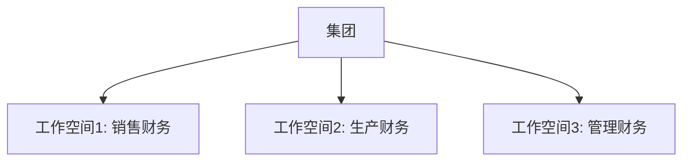
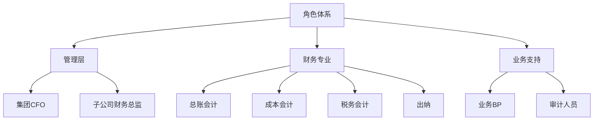
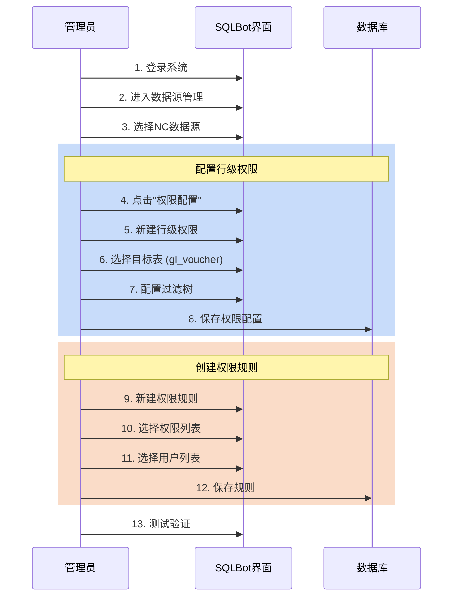

# NC 财务系统权限配置最佳实践

> [!NOTE]
> 本文档基于 SQLBot 的多层权限模型，针对 **用友 NC 财务系统** 的数据敏感性，提供生产环境的权限配置最佳实践和详细操作指南。

---

## 目录

1. [核心安全原则](#1-核心安全原则)
2. [权限架构设计](#2-权限架构设计)
3. [工作空间隔离策略](#3-工作空间隔离策略)
4. [行级权限详细配置](#4-行级权限详细配置)
5. [列级权限详细配置](#5-列级权限详细配置)
6. [角色权限矩阵设计](#6-角色权限矩阵设计)
7. [配置操作指南](#7-配置操作指南)
8. [测试与验证](#8-测试与验证)
9. [实战案例](#9-实战案例)
10. [故障排查](#10-故障排查)

---

## 1. 核心安全原则

财务数据属于企业核心机密，配置权限时应当遵循以下原则：

### 1.1 最小权限原则 (Least Privilege)

> 用户仅能访问其工作职责所需的最小数据范围。

**实施要点**:
- ✅ 默认拒绝，显式授权
- ✅ 按需分配，定期审计
- ✅ 分离职责，避免一人多权

### 1.2 纵深防御 (Defense in Depth)



### 1.3 NC 财务系统特殊考量

| 特性 | 说明 | 应对策略 |
|:-----|:-----|:---------|
| **多组织架构** | 集团-公司-部门层级 | 基于 `pk_org` / `pk_financeorg` 强制隔离 |
| **科目体系复杂** | 一级科目-明细科目 | 基于科目编码模式匹配过滤 |
| **辅助核算** | 客户/供应商/项目等维度 | 配置辅助核算表的权限规则 |
| **历史数据** | 跨年度数据积累 | 限制查询时间范围 (cyear, cmonth) |

---

## 2. 权限架构设计

### 2.1 NC 系统权限层次

```mermaid
graph TB
    subgraph 第一层：工作空间隔离
        WS1[集团财务空间]
        WS2[子公司财务空间]
        WS3[业务板块空间]
    end
    
    subgraph 第二层：行级权限
        ROW1[组织维度: pk_org]
        ROW2[科目维度: subjcode]
        ROW3[时间维度: cyear]
        ROW4[状态维度: billstatus]
    end
    
    subgraph 第三层：列级权限
        COL1[隐藏敏感金额字段]
        COL2[隐藏技术字段]
        COL3[隐藏辅助核算明细]
    end
    
    WS1 --> ROW1
    WS1 --> ROW2
    ROW1 --> COL1
    ROW2 --> COL2
```

### 2.2 推荐配置路径



---

## 3. 工作空间隔离策略

### 3.1 工作空间划分方案

#### 方案 A: 按财务组织划分 (推荐)



**适用场景**: 各子公司独立核算，数据完全隔离

**配置示例**:

| 工作空间名称 | 包含的 pk_org | 用户群体 |
|:-------------|:--------------|:---------|
| 集团本部财务 | `1001` | CFO, 集团会计 |
| 华东销售公司 | `2001, 2002, 2003` | 华东财务BP |
| 华北销售公司 | `3001, 3002` | 华北财务BP |

#### 方案 B: 按业务板块划分



**适用场景**: 关注业务条线，跨公司分析

### 3.2 工作空间配置步骤

**步骤 1: 创建工作空间**

在 SQLBot 管理后台:
1. 访问 **系统管理 > 工作空间管理**
2. 点击 **新建工作空间**
3. 输入:
   - 名称: `华东销售公司财务`
   - 描述: `包含华东地区所有销售公司的财务数据`

**步骤 2: 配置数据源**

1. 在该工作空间下创建数据源
2. 连接信息中添加预过滤条件 (可选):
   ```sql
   -- 在 Schema 配置中添加默认过滤
   SELECT * FROM gl_voucher WHERE pk_org IN (2001, 2002, 2003)
   ```

> [!TIP]
> 如果数据库账号本身就限制了访问范围（如通过视图），则无需在此配置。

**步骤 3: 添加用户**

1. 访问 **工作空间管理 > 成员管理**
2. 添加用户并设置权限:
   - **管理员**: 可配置权限规则
   - **普通成员**: 仅查询数据

---

## 4. 行级权限详细配置

### 4.1 基础隔离：组织维度

#### 目标

防止用户跨组织查询数据（最基础的安全要求）。

#### 配置对象

所有包含 `pk_org` 或 `pk_financeorg` 字段的表：

| 表名 | 说明 | 关键字段 |
|:-----|:-----|:---------|
| `gl_voucher` | 凭证主表 | pk_org |
| `gl_detail` | 凭证分录 | (继承主表) |
| `gl_balance` | 科目余额 | pk_org |
| `ap_paybill` | 付款单 | pk_org |
| `ar_recbill` | 收款单 | pk_org |
| `fa_card` | 固定资产 | pk_org |

#### 权限树配置

**配置界面路径**: 数据源管理 > 权限配置 > 新建行级权限

```json
{
    "name": "组织隔离-华东销售",
    "table": "gl_voucher",
    "type": "row",
    "tree": {
        "logic": "AND",
        "items": [
            {
                "type": "item",
                "field_id": 1001,        // pk_org 字段ID (需查看元数据)
                "term": "in",
                "enum_value": ["2001", "2002", "2003"]  // 华东公司ID列表
            }
        ]
    }
}
```

**说明**:
- `field_id`: 需要在 SQLBot 元数据中查找 `pk_org` 字段对应的 ID
- `enum_value`: 枚举允许访问的组织ID列表

#### 验证SQL

配置后，系统会将以下SQL:
```sql
SELECT * FROM gl_voucher WHERE cyear = '2024'
```

自动改写为:
```sql
SELECT * FROM gl_voucher 
WHERE cyear = '2024'
  AND pk_org IN ('2001', '2002', '2003')
```

### 4.2 敏感数据隔离：科目维度

#### 目标

防止非授权人员查询薪资、利润、成本等敏感会计科目数据。

#### NC 科目编码规则

```
6601 - 销售费用-工资
6602 - 管理费用-工资
6603 - 生产成本-工资
2211 - 应付职工薪酬
660101 - 销售费用-工资-基本工资
660102 - 销售费用-工资-奖金
```

#### 敏感科目清单

| 一级科目 | 科目名称 | 风险等级 | 建议屏蔽人员 |
|:---------|:---------|:---------|:-------------|
| `2211` | 应付职工薪酬 | 🔴 极高 | 除HR总监外所有人 |
| `6601-6603` | 各项费用-工资 | 🔴 极高 | 除财务总监外所有人 |
| `5001` | 生产成本 | 🟠 高 | 非成本会计 |
| `6001` | 销售费用-总账 | 🟠 高 | 非销售财务 |
| `6801` | 营业外支出 | 🟡 中 | 根据需要 |

#### 权限树配置（屏蔽薪资科目）

```json
{
    "name": "屏蔽薪资科目-普通会计",
    "table": "gl_detail",
    "type": "row",
    "tree": {
        "logic": "AND",
        "items": [
            {
                "type": "item",
                "field_id": 2005,        // subjcode 字段ID
                "term": "not like",
                "value": "2211%"         // 屏蔽应付职工薪酬
            },
            {
                "type": "item",
                "field_id": 2005,
                "term": "not like",
                "value": "6601%"         // 屏蔽销售费用-工资
            },
            {
                "type": "item",
                "field_id": 2005,
                "term": "not like",
                "value": "6602%"         // 屏蔽管理费用-工资
            },
            {
                "type": "item",
                "field_id": 2005,
                "term": "not like",
                "value": "6603%"         // 屏蔽生产成本-工资
            }
        ]
    }
}
```

#### 复杂场景：嵌套逻辑

**需求**: 允许查看销售费用，但屏蔽其中的工资和差旅费

```json
{
    "name": "销售费用-屏蔽敏感明细",
    "table": "gl_detail",
    "type": "row",
    "tree": {
        "logic": "OR",
        "items": [
            {
                "type": "item",
                "field_id": 2005,
                "term": "not like",
                "value": "6601%"     // 完全排除销售费用
            },
            {
                "type": "tree",
                "sub_tree": {
                    "logic": "AND",
                    "items": [
                        {
                            "type": "item",
                            "field_id": 2005,
                            "term": "like",
                            "value": "6601%"  // 是销售费用
                        },
                        {
                            "type": "item",
                            "field_id": 2005,
                            "term": "not like",
                            "value": "660101%" // 但不是工资
                        },
                        {
                            "type": "item",
                            "field_id": 2005,
                            "term": "not like",
                            "value": "660105%" // 且不是差旅费
                        }
                    ]
                }
            }
        ]
    }
}
```

**转换后的SQL片段**:
```sql
WHERE (
    subjcode NOT LIKE '6601%'
    OR (
        subjcode LIKE '6601%'
        AND subjcode NOT LIKE '660101%'
        AND subjcode NOT LIKE '660105%'
    )
)
```

### 4.3 时间维度限制

#### 目标

限制用户查询历史数据的时间范围，防止无限制翻阅历史账本。

#### 配置示例

**限制只能查询近3年数据**:

```json
{
    "name": "限制历史数据-近3年",
    "table": "gl_voucher",
    "type": "row",
    "tree": {
        "logic": "AND",
        "items": [
            {
                "type": "item",
                "field_id": 3001,    // cyear 字段ID
                "term": "ge",
                "value": "2022"      // >= 2022年
            }
        ]
    }
}
```

**动态时间计算** (如果支持):

```json
{
    "type": "item",
    "field_id": 3001,
    "term": "ge",
    "value": "${current_year - 3}"  // 当前年份-3
}
```

### 4.4 状态维度过滤

#### 目标

只允许查询已审核/已记账的单据，屏蔽草稿和作废数据。

```json
{
    "name": "仅查询已审核凭证",
    "table": "gl_voucher",
    "type": "row",
    "tree": {
        "logic": "AND",
        "items": [
            {
                "type": "item",
                "field_id": 4001,    // billstatus 字段ID
                "term": "eq",
                "value": "1"         // 1=已审核
            },
            {
                "type": "item",
                "field_id": 4002,    // dr 字段ID
                "term": "eq",
                "value": "0"         // 0=未删除
            }
        ]
    }
}
```

---

## 5. 列级权限详细配置

### 5.1 技术字段隐藏

#### 目标

隐藏业务人员无需关心的技术字段，减少AI Token消耗，降低幻觉。

#### NC 常见技术字段

| 字段名 | 说明 | 建议操作 |
|:-------|:-----|:---------|
| `ts` | 时间戳 | 隐藏 |
| `dr` | 删除标记 (0=正常, 1=删除) | 隐藏 |
| `creator` | 创建人ID | 保留ID，隐藏名称 |
| `modifier` | 修改人ID | 隐藏 |
| `creationtime` | 创建时间 | 可选保留 |
| `modifiedtime` | 修改时间 | 隐藏 |
| `pk_xxx` | 各种主键ID | 仅保留必要的关联键 |

#### 配置界面操作

**路径**: 数据源管理 > 权限配置 > 新建列级权限

**步骤**:
1. 选择目标表: `gl_voucher`
2. 字段可见性配置:

| 字段名 | 启用 | 说明 |
|:-------|:-----|:-----|
| pk_voucher | ✅ | 凭证ID - 保留 |
| vouchcode | ✅ | 凭证号 - 保留 |
| billdate | ✅ | 制单日期 - 保留 |
| pk_org | ✅ | 组织 - 保留 |
| ts | ❌ | 时间戳 - 隐藏 |
| dr | ❌ | 删除标记 - 隐藏 |
| creator | ❌ | 创建人ID - 隐藏 |

**JSON 配置**:

```json
{
    "table_id": 15,
    "type": "column",
    "permissions": [
        {"field_id": 101, "enable": true},   // pk_voucher
        {"field_id": 102, "enable": true},   // vouchcode
        {"field_id": 103, "enable": true},   // billdate
        {"field_id": 104, "enable": true},   // pk_org
        {"field_id": 201, "enable": false},  // ts
        {"field_id": 202, "enable": false},  // dr
        {"field_id": 203, "enable": false}   // creator
    ]
}
```

### 5.2 敏感金额字段隐藏

#### 场景: 运营分析人员

**需求**: 只需查看凭证数量、摘要，不需要看具体金额。

#### 配置示例

隐藏 `gl_detail` 表的金额字段:

```json
{
    "table_id": 16,
    "type": "column",
    "permissions": [
        {"field_id": 301, "enable": true},   // pk_detail
        {"field_id": 302, "enable": true},   // pk_voucher
        {"field_id": 303, "enable": true},   // explanation (摘要)
        {"field_id": 304, "enable": true},   // subjcode (科目编码)
        {"field_id": 305, "enable": false},  // debitamount (借方金额) ❌
        {"field_id": 306, "enable": false},  // creditamount (贷方金额) ❌
        {"field_id": 307, "enable": false},  // localdebitamount ❌
        {"field_id": 308, "enable": false}   // localcreditamount ❌
    ]
}
```

**效果**:
- 用户询问: "本月凭证数量是多少？" ✅ 可以回答
- 用户询问: "本月销售费用总额？" ❌ AI会提示"金额字段不可见"

### 5.3 辅助核算明细隐藏

#### 场景: 保护供应商/客户敏感信息

隐藏 `gl_detail` 中的辅助核算字段:

```json
{
    "permissions": [
        {"field_id": 401, "enable": false},  // pk_customer (客户)
        {"field_id": 402, "enable": false},  // pk_supplier (供应商)
        {"field_id": 403, "enable": false},  // pk_project (项目)
        {"field_id": 404, "enable": true}    // pk_dept (部门) - 保留
    ]
}
```

---

## 6. 角色权限矩阵设计

### 6.1 标准角色定义



### 6.2 权限矩阵详表

| 角色 | 组织范围 | 科目限制 | 金额可见 | 时间范围 | 典型查询 |
|:-----|:---------|:---------|:---------|:---------|:---------|
| **集团CFO** | 全部 | 无限制 | ✅ | 无限制 | 集团利润、成本分析 |
| **子公司财总** | 单一公司 | 无限制 | ✅ | 无限制 | 本公司全账 |
| **总账会计** | 单一公司 | 屏蔽薪资 | ✅ | 近3年 | 科目余额、试算平衡 |
| **成本会计** | 单一公司 | 仅成本科目 | ✅ | 近2年 | 成本归集、分摊 |
| **出纳** | 单一公司 | 仅现金/银行 | ✅ | 近1年 | 银行余额调节表 |
| **业务BP** | 业务板块 | 屏蔽薪资/成本 | ⚠️ 部分 | 近1年 | 费用趋势、预算执行 |
| **审计** | 全部 | 无限制 | ✅ | 无限制 | 异常交易、内控检查 |

### 6.3 角色配置示例

#### 角色: 总账会计

**1. 工作空间**: 华东销售公司财务

**2. 行级权限组合**:

```json
[
    {
        "rule_id": 1,
        "permission_name": "组织隔离-华东销售",
        "filter": "pk_org IN (2001, 2002)"
    },
    {
        "rule_id": 2,
        "permission_name": "屏蔽薪资科目",
        "filter": "subjcode NOT LIKE '2211%' AND subjcode NOT LIKE '660%01'"
    },
    {
        "rule_id": 3,
        "permission_name": "近3年数据",
        "filter": "cyear >= '2022'"
    }
]
```

**3. 列级权限**: 无（可查看所有字段）

**4. 用户关联**:

```sql
INSERT INTO ds_rules (permission_list, user_list) VALUES (
    '[1, 2, 3]',      -- 权限ID列表
    '[101, 102]'      -- 总账会计用户ID
);
```

#### 角色: 业务BP (财务辅助)

**1. 工作空间**: 销售板块

**2. 行级权限**:
- 组织隔离: 销售公司组
- 科目限制: 仅6001-6999费用类
- 时间限制: 近1年

**3. 列级权限**:
- 隐藏: 所有金额字段
- 保留: 凭证号、摘要、科目名称

**4. 典型查询验证**:
```
✅ "本月销售费用分类统计" - 返回类别和数量
❌ "本月销售费用总金额" - 提示字段不可见
```

---

## 7. 配置操作指南

### 7.1 权限配置完整流程



### 7.2 UI 配置示例 (文字版)

由于无法提供实际截图，以下用文字模拟配置界面：

#### 界面 1: 创建行级权限

```
┌─────────────────────────────────────────┐
│  新建行级权限                             │
├─────────────────────────────────────────┤
│  权限名称: [组织隔离-华东销售          ]  │
│                                          │
│  目标表:   [gl_voucher ▼]                │
│                                          │
│  权限类型: ⦿ 行级权限  ○ 列级权限         │
│                                          │
│  过滤条件构建器:                          │
│  ┌────────────────────────────────────┐  │
│  │ 逻辑关系: [AND ▼]                  │  │
│  │                                    │  │
│  │ [+] 添加条件                        │  │
│  │                                    │  │
│  │ 条件 1:                            │  │
│  │   字段:   [pk_org ▼]              │  │
│  │   操作符: [IN ▼]                  │  │
│  │   值:     [2001, 2002, 2003]      │  │
│  │   [删除]                           │  │
│  └────────────────────────────────────┘  │
│                                          │
│  [取消]              [保存]              │
└─────────────────────────────────────────┘
```

#### 界面 2: 关联用户到权限规则

```
┌─────────────────────────────────────────┐
│  权限规则管理                             │
├─────────────────────────────────────────┤
│  规则名称: [华东销售-普通会计权限      ]  │
│                                          │
│  关联权限:                               │
│  ┌────────────────────────────────────┐  │
│  │ ☑ 组织隔离-华东销售                 │  │
│  │ ☑ 屏蔽薪资科目                      │  │
│  │ ☑ 近3年数据                        │  │
│  │ ☐ 隐藏金额字段                     │  │
│  └────────────────────────────────────┘  │
│                                          │
│  分配用户:                               │
│  ┌────────────────────────────────────┐  │
│  │ 已选用户:                           │  │
│  │   • 张三 (zhangsan)                │  │
│  │   • 李四 (lisi)                    │  │
│  │                                    │  │
│  │ [+ 添加用户]                        │  │
│  └────────────────────────────────────┘  │
│                                          │
│  [取消]              [保存]              │
└─────────────────────────────────────────┘
```

### 7.3 JSON 配置方式 (高级)

对于批量配置，可以直接操作数据库：

```sql
-- 1. 创建权限配置
INSERT INTO ds_permission (table_id, type, name, tree) VALUES
(15, 'row', '组织隔离-华东销售', '{
    "logic": "AND",
    "items": [
        {
            "type": "item",
            "field_id": 1001,
            "term": "in",
            "enum_value": ["2001", "2002", "2003"]
        }
    ]
}');

-- 2. 创建权限规则
INSERT INTO ds_rules (permission_list, user_list) VALUES
('[100, 101, 102]', '[201, 202]');
```

---

## 8. 测试与验证

### 8.1 测试环境准备

> [!IMPORTANT]
> 在生产环境配置前，**务必**在测试环境完整验证所有权限规则。

**测试账号矩阵**:

| 测试账号 | 模拟角色 | 预期行为 |
|:---------|:---------|:---------|
| test_cfo | 集团CFO | 无限制查询 |
| test_acc | 总账会计 | 组织+科目限制 |
| test_bp | 业务BP | 无金额可见 |
| test_audit | 审计 | 全权限 |

### 8.2 测试用例清单

#### 用例 1: 组织隔离测试

**测试账号**: test_acc (绑定到华东销售)

**测试问题**:
```
1. "查询本月凭证数量" 
   预期: 仅返回华东销售公司的数据
   
2. "查询华北公司的凭证"
   预期: 返回空或提示无权限

3. "查询所有公司的凭证汇总"
   预期: 仅汇总华东数据
```

**验证方法**:
```sql
-- 检查生成的SQL是否包含组织过滤
-- 查看 chat_log 表中的最终执行SQL
SELECT full_message FROM chat_log 
WHERE operate = 'GENERATE_SQL_WITH_PERMISSIONS'
ORDER BY create_time DESC LIMIT 1;

-- 预期包含:
-- WHERE ... AND pk_org IN ('2001', '2002', '2003')
```

#### 用例 2: 敏感科目屏蔽测试

**测试账号**: test_acc

**测试问题**:
```
1. "查询应付职工薪酬余额"
   预期: ❌ "该科目受权限限制"
   
2. "查询6601科目借方发生额"
   预期: ❌ 返回空或提示无权限
   
3. "查询销售费用-差旅费"
   预期: ✅ 正常返回
```

#### 用例 3: 列级权限测试

**测试账号**: test_bp (隐藏金额字段)

**测试问题**:
```
1. "本月凭证数量"
   预期: ✅ 返回数量

2. "本月费用总额"
   预期: ❌ "金额字段不可见"
   
3. "列出本月所有凭证的摘要"
   预期: ✅ 返回摘要列表
```

### 8.3 自动化测试脚本

```python
# test_permissions.py
import requests

BASE_URL = "http://localhost:8000/api"
TEST_CASES = [
    {
        "user": "test_acc",
        "question": "查询应付职工薪酬余额",
        "expect_error": True,
        "error_keyword": "权限"
    },
    {
        "user": "test_acc",
        "question": "查询本月凭证数量",
        "expect_error": False,
        "check_sql": "pk_org IN"
    }
]

def run_tests():
    for case in TEST_CASES:
        # 1. 登录获取token
        token = login(case["user"])
        
        # 2. 发送查询请求
        response = chat(token, case["question"])
        
        # 3. 验证结果
        if case["expect_error"]:
            assert case["error_keyword"] in response["error"]
        else:
            assert case["check_sql"] in get_executed_sql(response["record_id"])
        
        print(f"✅ {case['user']} - {case['question']}")

if __name__ == "__main__":
    run_tests()
```

### 8.4 用户验收测试 (UAT)

**参与人员**: 实际业务用户

**测试步骤**:
1. 向每个角色发放测试账号
2. 提供标准测试问题清单
3. 记录测试结果和用户反馈
4. 根据反馈调整权限配置

**UAT 反馈表模板**:

| 问题 | 预期结果 | 实际结果 | 通过 | 备注 |
|:-----|:---------|:---------|:-----|:-----|
| 查询本公司XX数据 | 正常返回 | ✅ 正常 | ✅ | |
| 查询其他公司数据 | 拒绝/空 | ✅ 拒绝 | ✅ | |
| 查询薪资科目 | 拒绝 | ❌ 返回了数据 | ❌ | 需调整 |

---

## 9. 实战案例

### 案例 1: 集团多公司财务系统

#### 背景

某集团有5家子公司，使用统一NC系统，需要实现:
- 各子公司财务只能查本公司数据
- 集团财务可查所有数据
- 薪资科目只有HR总监可见

#### 解决方案

**1. 工作空间设计**:
- 创建6个工作空间 (集团 + 5个子公司)
- 集团CFO同时加入所有工作空间

**2. 行级权限配置**:

```json
// 子公司A - 组织隔离
{
    "name": "子公司A-组织隔离",
    "table": "gl_voucher",
    "tree": {
        "logic": "AND",
        "items": [
            {"field_id": 1001, "term": "eq", "value": "1001"}
        ]
    }
}

// 薪资科目屏蔽 (所有子公司共用)
{
    "name": "屏蔽薪资科目",
    "table": "gl_detail",
    "tree": {
        "logic": "AND",
        "items": [
            {"field_id": 2005, "term": "not like", "value": "2211%"},
            {"field_id": 2005, "term": "not like", "value": "660%01"}
        ]
    }
}
```

**3. 用户权限分配**:

| 用户 | 工作空间 | 权限规则 |
|:-----|:---------|:---------|
| 集团CFO | 所有 | 无限制 (管理员) |
| 子公司A财务 | 子公司A | 组织隔离 + 薪资屏蔽 |
| HR总监 | 集团 | 仅薪资科目可见 |

#### 效果

- ✅ 子公司财务无法查看其他公司数据
- ✅ 普通会计无法查询工资
- ✅ HR总监可以跨公司查薪资
- ✅ 集团CFO拥有全部权限

### 案例 2: 审计场景 - 异常交易检测

#### 背景

内审部门需要检测跨期调账、大额费用等异常，但不应看到具体金额明细。

#### 配置策略

**1. 创建专用工作空间**: "审计专用"

**2. 行级权限**: 无限制 (可查所有组织)

**3. 列级权限**: 隐藏金额，保留异常标识

```json
{
    "table_id": 16,
    "type": "column",
    "permissions": [
        {"field_id": 301, "enable": true},   // 凭证号
        {"field_id": 302, "enable": true},   // 日期
        {"field_id": 303, "enable": true},   // 摘要
        {"field_id": 304, "enable": true},   // 科目
        {"field_id": 305, "enable": false},  // 金额 ❌
        {"field_id": 306, "enable": true},   // 审核状态
        {"field_id": 307, "enable": true}    // 异常标识
    ]
}
```

**4. 审计查询示例**:
```
✅ "查询本月跨期调账的凭证数量"
✅ "列出所有未审核但已记账的凭证"
❌ "查询大额费用的具体金额" - 金额字段不可见
```

---

## 10. 故障排查

### 10.1 常见问题诊断

#### 问题 1: 权限配置后未生效

**症状**: 用户仍能看到不应该看到的数据

**排查步骤**:

1. **检查用户是否为管理员**
   ```sql
   SELECT id, username, role FROM sys_user WHERE id = <用户ID>;
   -- role = 1 为管理员，不受权限限制
   ```

2. **检查权限规则关联**
   ```sql
   SELECT * FROM ds_rules 
   WHERE user_list LIKE '%<用户ID>%';
   
   -- 检查返回的 permission_list 是否包含目标权限
   ```

3. **检查权限树配置**
   ```sql
   SELECT id, name, tree FROM ds_permission 
   WHERE id IN (<permission_list>);
   ```

4. **查看实际执行的SQL**
   ```sql
   SELECT full_message FROM chat_log 
   WHERE record_id = <记录ID> 
     AND operate = 'GENERATE_SQL_WITH_PERMISSIONS';
   ```

**解决方案**:
- 如果是管理员，需改为普通用户或使用测试账号
- 检查 `ds_rules` 表中 JSON 格式是否正确
- 验证 `field_id` 是否对应正确的字段

#### 问题 2: AI 提示字段不存在

**症状**: 配置列级权限后，AI 报错 "字段 XXX 不存在"

**原因**: 列级权限已生效，AI 看不到该字段

**解决方案**:
- ✅ 这是正常现象，说明权限生效
- 可在自定义Prompt中添加提示:
  ```
  当用户询问受限字段时，回复:
  "该字段受权限限制，无法查询。如需访问请联系管理员。"
  ```

#### 问题 3: 性能下降

**症状**: 配置复杂权限树后查询明显变慢

**排查**:
```sql
-- 检查权限过滤字段是否有索引
SHOW INDEX FROM gl_detail;

-- 查看执行计划
EXPLAIN SELECT * FROM gl_detail 
WHERE subjcode NOT LIKE '2211%' 
  AND subjcode NOT LIKE '6601%';
```

**优化建议**:
1. **为过滤字段添加索引**
   ```sql
   CREATE INDEX idx_subjcode ON gl_detail(subjcode);
   CREATE INDEX idx_pk_org ON gl_voucher(pk_org);
   ```

2. **简化权限树**
   - 避免过多 `LIKE` 查询
   - 减少嵌套层级
   - 合并相似条件

3. **使用标识字段**
   ```sql
   -- 在ETL阶段添加敏感标识
   ALTER TABLE gl_detail ADD COLUMN is_sensitive TINYINT DEFAULT 0;
   
   -- 权限配置改为
   WHERE is_sensitive = 0
   ```

### 10.2 调试技巧

#### 启用详细日志

```python
# backend/common/core/config.py
LOG_LEVEL = "DEBUG"

# 查看权限处理日志
tail -f logs/sqlbot.log | grep -i permission
```

#### 使用管理员测试SQL

```sql
-- 以管理员登录，手动执行权限改写后的SQL
SELECT * FROM gl_voucher 
WHERE cyear = '2024'
  AND pk_org IN ('2001', '2002')
  AND billstatus = 1;
```

#### 对比Schema差异

```python
# 获取管理员看到的Schema
admin_schema = get_table_schema(admin_user, 'gl_detail')

# 获取普通用户看到的Schema
user_schema = get_table_schema(test_user, 'gl_detail')

# 对比差异
diff_fields = set(admin_schema.fields) - set(user_schema.fields)
print(f"隐藏字段: {diff_fields}")
```

---

## 11. 最佳实践总结

### 11.1 配置原则

1. ✅ **先粗后细**: 先配置组织隔离，再配置科目/字段限制
2. ✅ **先测后上**: 测试环境完整验证后再上生产
3. ✅ **文档记录**: 维护权限配置文档，记录每个规则的用途
4. ✅ **定期审计**: 每季度审查用户权限，及时调整

### 11.2 安全检查清单

上线前确保:

- [ ] 数据库使用只读账号
- [ ] 所有表配置了组织隔离
- [ ] 敏感科目已屏蔽 (薪资/成本/利润)
- [ ] 技术字段已隐藏
- [ ] 至少3个角色完成UAT测试
- [ ] 配置了审计日志查询
- [ ] 制定了权限变更流程

### 11.3 运维建议

**权限变更流程**:


**监控指标**:
- 权限拒绝次数 (异常增长 → 配置问题)
- SQL执行时间 (突增 → 权限过滤影响性能)
- 用户投诉 (权限过严或过松)

---

## 12. 附录

### 12.1 NC 常见表权限配置参考

| 表名 | 推荐行级权限 | 推荐列级权限 |
|:-----|:-------------|:-------------|
| `gl_voucher` | pk_org, cyear, billstatus | 隐藏: ts, dr, creator |
| `gl_detail` | (继承主表) + subjcode | 隐藏: 技术字段 |
| `gl_balance` | pk_org, cyear, subjcode | 隐藏: 辅助核算PK |
| `bd_accsubj` | 无 (全局可见) | 隐藏: 技术字段 |
| `ap_paybill` | pk_org | 隐藏: 审批流程字段 |

### 12.2 SQL 过滤片段速查

```sql
-- 屏蔽已删除
dr = 0

-- 仅查已审核
billstatus IN (1, 2)

-- 近3年
cyear >= YEAR(NOW()) - 3

-- 本年度
cyear = YEAR(NOW())

-- 屏蔽调整期
cmonth BETWEEN 1 AND 12

-- 多组织
pk_org IN ('1001', '2001', '3001')

-- 科目区间
subjcode BETWEEN '6001' AND '6999'

-- 屏蔽某科目
subjcode NOT LIKE '2211%'
```

### 12.3 参考资源

- [SQLBot 权限控制实现详解](../23-permission-implementation.md)
- [SQLBot 安全设计](../10-security-design.md)
- 用友NC开发手册 - 数据权限章节

---

**文档版本**: v2.0  
**最后更新**: 2026-01-04  
**维护人**: SQLBot 文档团队
